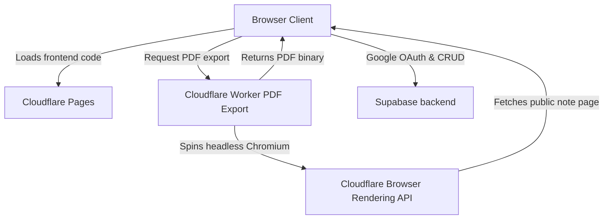

# Medicine Cloud Deployment & Setup Guide

This guide details how to set up and host the **Medicine Cloud** web application on **Cloudflare Pages**, with a serverless PDF rendering engine on **Cloudflare Workers** (using Chromium), and a database backend on **Supabase** (with Google OAuth).

---

## Architecture Diagram



---

## Step 1: Set Up Supabase Database & Auth

Supabase provides the PostgreSQL database, authentication, and Row Level Security (RLS) policies.

### 1.1 Create a Supabase Project
1. Sign in to the [Supabase Dashboard](https://supabase.com/dashboard).
2. Click **New Project** and select your Organization.
3. Choose a project name (e.g., `medicine-cloud`), database password, and region. Click **Create new project**.

### 1.2 Initialize Database Tables
1. Once your project is ready, navigate to the **SQL Editor** tab in the left sidebar.
2. Click **New Query** (or choose a blank query editor).
3. Open [supabase-setup.sql](file:///c:/Users/Abdoollah/Documents/Medical-Cloud/MC-WEB_APP/supabase-setup.sql) from the project directory.
4. Copy the entire file content, paste it into the Supabase editor, and click **Run**.
5. *Verify:* You should see output indicating that tables were created and RLS policies were successfully applied.

### 1.3 Add Allowed Users
To bypass the security gate, you must authorize your Google email:
1. In the Supabase SQL editor, run the following SQL query (replace with your actual Google account email):
   ```sql
   INSERT INTO allowed_users (email) 
   VALUES ('your.google.email@gmail.com');
   ```

### 1.4 Enable Google Sign-In
To support Google OAuth login:
1. Go to the [Google Cloud Console](https://console.cloud.google.com/).
2. Create a new project or select an existing one. Go to the **OAuth consent screen** page, configure it for "External" users, and fill out the details.
3. Under **Credentials**, click **Create Credentials** -> **OAuth client ID**.
4. Choose **Web application** as the application type.
5. In the **Authorized redirect URIs** section, add your Supabase redirect URI. Find this in the Supabase Dashboard under:
   > **Project Settings** -> **API** -> **API URL** (it looks like `https://<project-ref>.supabase.co/auth/v1/callback`)
6. Copy the generated **Client ID** and **Client Secret**.
7. Return to the **Supabase Dashboard**, go to **Authentication** -> **Providers** -> **Google**.
8. Toggle it to **Enabled**, paste the Google Client ID and Client Secret, and click **Save**.

---

## Step 2: Set Up the PDF Export Cloudflare Worker

The PDF Export Worker launches a serverless instance of Chromium via Cloudflare Browser Rendering to capture and export note pages as clean, standard PDFs.

### 2.1 Enable Browser Rendering in Cloudflare
1. Log in to the [Cloudflare Dashboard](https://dash.cloudflare.com).
2. Select your account, and navigate to **Workers & Pages** -> **Browser Rendering** in the sidebar.
3. Click **Get Started** (or enable the free trial/tier).

### 2.2 Deploy the Worker
From your local project terminal:
1. Make sure you are authenticated with Cloudflare's Wrangler CLI:
   ```bash
   npx wrangler login
   ```
2. Deploy the worker using the configuration in [wrangler.toml](file:///c:/Users/Abdoollah/Documents/Medical-Cloud/MC-WEB_APP/wrangler.toml):
   ```bash
   npm run deploy:worker
   ```
3. Copy the deployed worker URL from the output (it will look like `https://mc-pdf-export.<your-subdomain>.workers.dev`).

---

## Step 3: Deploy the Frontend to Cloudflare Pages

Cloudflare Pages hosts the static HTML/CSS/JS frontend files and handles the build-time injection of environment variables.

### 3.1 Upload to GitHub
1. Create a private repository on GitHub (e.g., `medical-cloud-web-app`).
2. Push your project code to GitHub:
   ```bash
   git init
   ```
   *(Ensure `dist/` and `.env` are in your `.gitignore` to keep configurations private).*
   ```bash
   git add .
   ```
   ```bash
   git commit -m "Initial commit for web deployment"
   ```
   ```bash
   git remote add origin https://github.com/your-username/medical-cloud-web-app.git
   ```
   ```bash
   git branch -M main
   ```
   ```bash
   git push -u origin main
   ```

### 3.2 Create Cloudflare Pages Project
1. In the **Cloudflare Dashboard**, navigate to **Workers & Pages** -> **Create** -> **Pages**.
2. Click **Connect to Git** and choose the GitHub repository you just created.
3. Click **Begin setup**.
4. Configure the Build settings:
   - **Framework preset**: `None`
   - **Build command**: `npm run build`
   - **Build output directory**: `dist`
5. Expand the **Environment variables (advanced)** section and add the following keys:
   - `MC_SUPABASE_URL` — *(Copy from Supabase Settings -> API -> Project URL)*
   - `MC_SUPABASE_ANON_KEY` — *(Copy from Supabase Settings -> API -> `anon` public key)*
   - `CLOUDFLARE_WORKER_URL` — *(Paste the Worker URL copied in Step 2.2)*

6. Click **Save and Deploy**. Cloudflare will run `npm run build` which replaces the `__PLACEHOLDER__` values inside HTML scripts with your actual variables.
7. Once deployed, note down your production site URL (e.g., `https://medicine-cloud.pages.dev`).

---

## Step 4: Finalize Cors & Redirect configurations

Now we hook the deployed parts together so they can interact securely.

### 4.1 Update Worker Allowed Origin
The PDF Worker prevents unauthorized websites from using your PDF API. You need to tell it which domain name is allowed:
1. Go to the Cloudflare dashboard -> **Workers & Pages** -> **Overview** -> click on **mc-pdf-export**.
2. Go to the **Settings** tab -> **Variables**.
3. Under **Environment Variables**, click **Add Variable**:
   - Name: `APP_ORIGIN`
   - Value: `https://your-production-app.pages.dev` (your Cloudflare Pages site URL)
4. Click **Deploy**.

### 4.2 Configure Redirects in Supabase Auth Settings
To ensure Google OAuth redirects users back to your site correctly:
1. Go to **Supabase Dashboard** -> **Authentication** -> **URL Configuration**.
2. Under **Site URL**, enter your Cloudflare Pages production URL: `https://your-production-app.pages.dev/pages/login.html`
3. Under **Redirect URLs**, add:
   - `https://your-production-app.pages.dev/pages/login.html`
   - `https://your-production-app.pages.dev/pages/dashboard.html`
4. Click **Save**.

### 4.3 Configure CORS in Supabase (Optional but Recommended)
To restrict database access strictly to your domain:
1. Go to **Supabase Dashboard** -> **API** -> **API Settings**.
2. Scroll to **CORS**, and add your site URL `https://your-production-app.pages.dev` to the list of allowed origins.

---

## Step 5: Test Your Live App 🎉

1. Navigate to your Cloudflare Pages production URL.
2. You will be redirected to the Login page.
3. Click **Sign In with Google**.
4. Select the Google account corresponding to the email address you added to the `allowed_users` table in Step 1.3.
5. If successful, you will be authenticated and redirected to your live **Medicine Cloud Dashboard**.
6. Create a note, switch theme to Dark, open the note, and click **Export as PDF** to test the serverless browser rendering pipeline.
